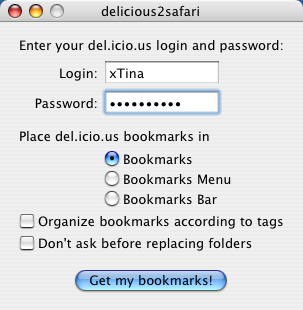
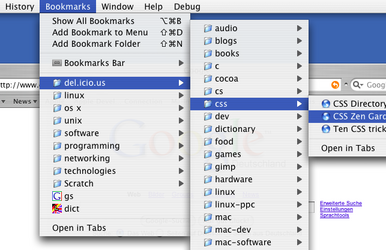
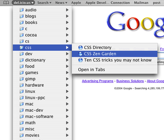
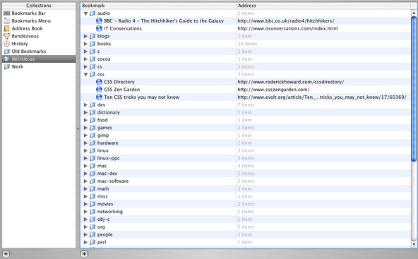
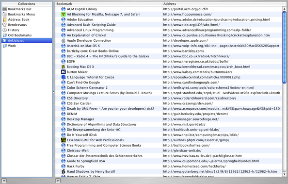

**_This repository contains the source code of delicious2safari 1.2.1
as released 2006-06-24. It exists purely for archival purposes, you
probably don't want to use it ;)_**

# delicious2safari
Import your del.icio.us bookmarks into Safari.

## Features

* Imports your bookmarks as a flat list, or let delicious2safari organize them
into folders according to their del.icio.us tags
* Lets you choose between downloading to a folder in your Bookmarks Bar, your Bookmarks Menu, or your Safari bookmarks
* Fast, small Cocoa application
* Uses Mac OS X Keychain for password storage
* Once your del.icio.us bookmarks are in Safari, you can also use them with third party applications, such as Quicksilver!

## Changes

* 1.2.1 (2006-06-24) Uses the new del.icio.us API URL
* 1.2u (2006-05-15) Universal Binary
* 1.2 (2005-03-02) Fix for ampersands being escaped as XML entities, small documentation changes
* 1.1 (2004-09-30) Much faster downloads, delicious2safari now identifies with own User-Agent string
* 1.0.1 (2004-09-30) Improved download code to put less strain on the del.icio.us server

## System Requirements

* Mac OS X 10.3 (Panther) or later
* a del.icio.us account

## Screenshots

### Application

### Safari

### Grouped by Tag

### Flat List

